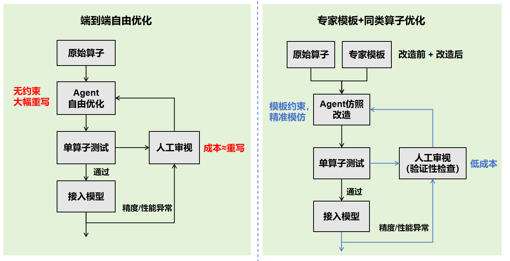
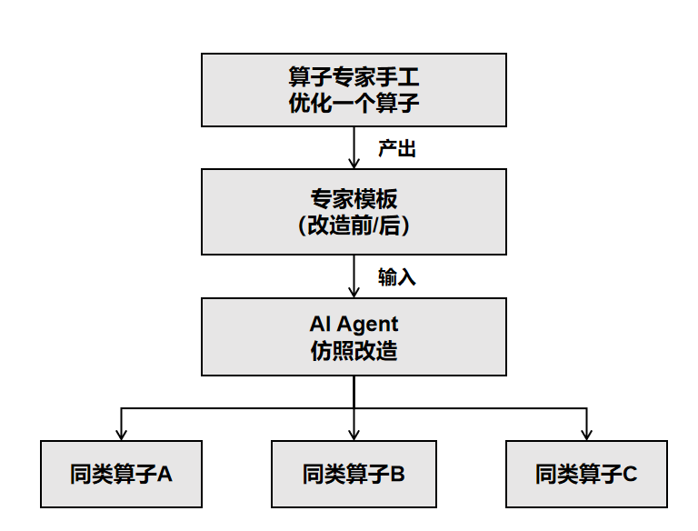
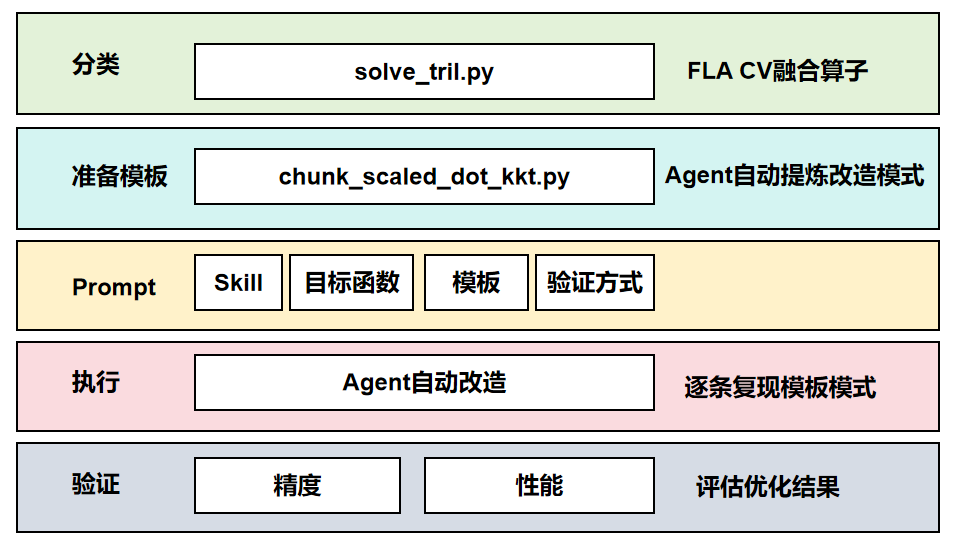

# 同类算子开发优化：让 AI Agent 学会举一反三

## 开篇：Agent 能力与局限的诚实陈述

在大模型推理业务场景中，算子开发面临规模化难题。本文的核心思想是**在 Skill 约束下，让 AI Agent 完成昇腾亲和的同类 Triton 算子开发与优化**。在介绍这套方法论之前，先分享团队在探索 Agent 辅助算子开发过程中走过的弯路与教训。

### 前言：对 Agent 在算子开发任务上的一点探索和思考

在昇腾实际推理业务中，将 GPU 原生算子迁移适配至昇腾并实现极致性能优化，是 Triton 算子开发的核心诉求之一。

最初，我们尝试以 Skills 提供指导，让 Agent 自主完成算子的迁移适配与性能优化。Agent 的核心循环（Ralph-loop）是标准的 `while not done` 模式：调用大模型（OpenAI responses / Anthropic 兼容 API）→ 推理规划 → 执行动作（Plugins / MCPs）→ 更新状态，通过持续迭代实现目标。

在具体实现上，我们将算子开发经验总结为 Skills，定义了如下工作流：原生算子基线精度与性能验证 → 算子优化 → 优化算子的精度性能验证，目标是将原生算子性能提升若干倍。以原生算子和单算子精度性能测试脚本作为输入，开启 Ralph-loop 模式，经过数小时迭代优化后输出优化算子，并将过程中遇到的问题和约束持续沉淀到 Skills 中。

这套流程通常能产出精度通过、性能提升的单算子版本。然而，将算子接入模型后，精度异常和性能劣化问题频发，无一算子可直接投入使用。问题根源在于：模型实际运行时的输入输出 shape 远超单算子测试用例的覆盖范围，**生成的算子存在严重的泛化性问题**。

为此，我们尝试了两种改进方案：一是扩充单算子测试用例，覆盖更多 shape 场景，并与模型侧整网验证环境对齐——但此方案工作量大，且采集的 shape 终归有限，线上仍有问题爆发的风险；二是由 Agent 根据原生算子实现自主构造测试脚本——但同样无法解决泛化性问题。

至此，Agent 自主闭环算子开发的路径宣告失败。我们开始将人工审视纳入工作流，在关键节点通过 Instruction 进行干预，将整个算子开发任务拆分为若干步骤：测试脚本开发、性能瓶颈分析、优化版本开发、精度性能验证。Agent 依次执行每个步骤，人工审视各步骤输出是否合理。

这种方式降低了各阶段任务难度：精度性能测试等机械性步骤 Agent 能准确执行，性能瓶颈分析在 Skills 指导下也基本有效。但在优化版本开发阶段，泛化性问题再次出现——Agent 的优化方案与测试脚本的 shape 强耦合，且改动幅度接近重写，人工定位问题的成本不亚于从头手写一个算子。

**如何高效、可控地实现 Agent 辅助算子开发，成为主要研究方向。**

---

## 一、问题的本质：重复劳动正在消耗专家价值

昇腾 NPU 上的 Triton 算子优化，是一门高度专业的手艺活。

一位经验丰富的算子工程师，面对一个新算子，脑中会迅速完成一系列精准判断：Grid 该如何绑核？UB 容量能容纳几个 Token？哪里能做访存-计算流水并行？哪些 mask 可以消除？这些判断背后，是对昇腾硬件架构的深刻理解——Scalar、MTE、Vector、Cube 流水线如何协作，缓存如何分配，并行的约束边界在哪里。

然而，**这些判断具有极强的模式性。** 同一类算子——例如同属 FLA（Flash Linear Attention）的一组矩阵运算 kernel，或同属 normalization 流程的一组 Vector kernel——它们的优化手法高度相似：Grid 绑核方式相同，持久化循环写法相同，`do_not_specialize` 需要添加的参数相同，甚至常见的坑（忘记恢复 T 值、多维 Grid 展开公式写反）也相同。

一位专家花一天优化好一个算子，回头看同目录下还有五个结构相似的——每个再花半天，就是三天重复劳动。**专家的时间，正在被机械性的重复消耗。**

**核心问题由此浮现：能不能把专家的"手法"提炼成模板，让 AI Agent 去完成那五个？**

---

## 二、Skill 是什么：一段被编纂的专家经验

`triton-ascend-ops-optimizer` Skill 是我们在算子调试过程中提炼总结的**结构化算子优化知识体系**，由三个核心文件组成：

| 文件 | 角色 |
|------|------|
| `SKILL.md` | **主控文件**——定义优化目标、工作流程、优化技术、约束规则 |
| `references/hardware_constraints.md` | **硬件参考手册**——Ascend 910B 三引擎架构、UB 容量计算公式、流水线并行条件 |
| `references/troubleshooting.md` | **排错指南**——典型问题的诊断路径和修复方法 |

Agent 加载该 Skill 后，并非"自由发挥"，而是在一套严格的闭环框架下工作：

1. **先测基线**：深入分析算子结构，跑通正确性验证，记录初始性能数据。
2. **再做优化**：每次修改后，先验证正确性，再量化性能。正确性验证不通过，不允许进行性能测量。
3. **按需查文档**：遇到 UB 溢出查容量计算公式，遇到流水线断裂查硬件约束。
4. **迭代至达标**：性能未达标则持续优化，达标后输出标准化报告。

Skill 内化了**多条优化技术**，每一条都直指昇腾硬件的核心约束：

- **Grid 固定绑核**：`grid = (get_vectorcore_num(), )`，不随数据形状变化——确保算子泛化性。
- **多 Token 批处理**：计算 UB 能容纳的最大 Token 数（`N = 85×1024 // S_token`），批量装满，避免逐 Token 访存。
- **避免重编译**：`do_not_specialize` 管住会变化的标量参数，一次编译覆盖所有 batch size。
- **消除 mask 开销**：`tl.load` 不带 `other` 参数，mask 延后处理，保住 MTE/Vector 流水线。
- **加载-计算交织**："装一车算一车"，而非"全装完再算"——有效隐藏访存延迟。

**然而，Skill 单独工作时存在一个根本局限：它知道"怎么优化"，但不清楚面前这个具体算子该"优化成什么样子"。** 缺少具体的目标形态，Agent 倾向于大幅重写算子代码——单算子测试虽能通过，接入模型后却频频出问题。

**这正是"同类算子开发优化"方法论要解决的问题。**

---

## 三、核心洞察：专家模板 + Agent 仿照

### 3.1 端到端自由优化为何失败

在提炼出当前方法论之前，我们最初尝试的是**端到端自由优化**：直接把算子和目标性能指标交给 Agent，不提供任何模板，让它自主完成优化。

结果看似不错：Agent 生成的算子往往能通过单算子测试用例，性能数据也达标。但一旦接入实际模型运行，问题就暴露了——**精度异常、性能回退、行为不一致。**

根本原因在于，Agent 为了达成性能目标并通过测试用例，会对算子进行**大幅度修改，几乎接近重写**。这带来了两个严重后果：

| 问题 | 根因 | 后果 |
|------|------|------|
| **泛化性失控** | 优化后的算子只针对测试脚本覆盖的场景做了适配，而实际模型中的输入 shape、数据分布远比测试用例复杂 | 单算子测试全过，接入模型后精度或性能出问题 |
| **审视成本爆炸** | Agent 几乎重写了整个算子，改动范围覆盖调度逻辑和计算逻辑 | 人工定位问题时，面对的不是"一处改动"而是"一整个新算子"，审视成本接近于从头写一遍 |

问题的本质在于：**单算子测试脚本几乎不可能覆盖算子在模型中真正面临的所有场景。** Agent 越是"自由发挥"，优化结果就越依赖于测试覆盖的完整性——而这恰恰是最不可靠的假设。

这段经历让我们意识到：问题不在于 Agent 能力不足，而在于**给 Agent 的约束不足**。需要一种方式，把 Agent 的修改范围严格限定在可控边界内。

以下对比清晰展示了两种路径的本质差异：



### 3.2 给 Agent 一道例题和标准答案

**通过给 Agent 一道例题和标准答案，让它去做同类题。**

给予了 Agent 更多的约束——**"专家模板 + AI 仿照"**：



通过平衡人工审视和 Agent 的特点：

| 角色 | 擅长 | 不擅长 |
|------|------|--------|
| **专家** | 判断与创造——发明优化手法，定义"该改什么、不该动什么"的边界 | 重复——把同一套手法机械地施加到十几个相似算子上 |
| **Agent** | 重复与精确——严格模仿一种模式，在结构相似的代码上一致地执行 | 创造——从零发明一种新的优化范式 |

模板消除了发散性。Agent 不再需要决定"怎么优化"，只需要回答一个简单得多的问题：**"模板做了哪些改动？面前这个算子的对应位置在哪里？"**

### 3.3 两种模板，覆盖两类算子

针对不同类型的算子，分别提供对应类别内的优化模板：在输入原生算子的同时，额外提供相应的优化模板作为参考样例。实践中，当前分别在 vllm-ascend 的 CV 融合算子（以 GDN——Gated Delta Networks 的小算子为例）和纯 Vector 算子（以 Split_qkv、RMSNorm、RoPE 融合算子为例）上进行验证，后续会对类别进行进一步细分以实现领域定制优化：

**CV 算子**（含 `tl.dot` 矩阵运算）——改造仅触及调度层：

| 改动 | 说明 |
|------|------|
| Grid `(NT, B*H)` → `(AICORE_NUM,)` | 绑定物理核心数 |
| 新增 `grid0` 参数 | 解耦物理 Grid 与逻辑工作量 |
| `for i in range(pid, grid0, core_num)` | 持久化循环 |
| `T_orig = T` + 循环内恢复 | VARLEN 模式保护 |
| **内部计算逻辑完全不变** | 纯调度优化 |

**Vector 算子**（RMSNorm、RoPE 等）——改造深入计算和访存层：

| 改动 | 说明 |
|------|------|
| 多维 Grid → 一维绑核 | 消除分块维度 |
| 三循环 → 单循环融合 | 访存次数 3 → 1 |
| 分块 mask → 整行无 mask | 连续 DMA 传输 |
| Q+K RMSNorm 合并 | 减少计算冗余 |
| V early-store | MTE 与 Vector 流水并行 |

---

## 四、业务价值：不只是快，而是"规模化地快"

### 4.1 开发效率提升

在投入产出上：

| 阶段 | 投入 | 产出 |
|------|------|------|
| 专家优化第 1 个算子 | **高**（需硬件经验 + 多轮调试） | 1 个优化算子 + 1 个可复用模板 |
| Agent 仿照第 2～N 个 | **低**（编写 Prompt + 审视输出） | N−1 个优化算子 |

**第 1 个算子的专家投入是一次性成本，此后每个同类算子的边际成本逐步降低，当模板库成熟时，边际成本趋近于零。**

在当前实践中：对于 CV 融合算子，以 `chunk_scaled_dot_kkt` 算子的改造经验为模板，成功在 `solve_tril`、`wy_fast` 等其余 GDN 算子上实现 Grid 昇腾亲和改造；对于 Vector 算子，以 `split_qkv_rmsnorm_mrope` 的优化经验为模板，成功在 `split_qkv_rmsnorm_rope` 算子上实现性能优化，**单算子性能提升 2 倍以上**。

### 4.2 人工审视成本大幅下降

Agent 的改动被模板严格约束——改什么、不改什么、改的边界在哪里，全部由模板定义。审视者不需要理解"Agent 为什么这样改"，只需要检查"Agent 是否忠实地复现了模板模式"。

这把代码审视从一个**开放性问题**（"这段优化合不合理？"）转化为一个**验证性问题**（"这段改动和模板一致吗？"）。

### 4.3 意义

- **加速算子适配进度**：大模型推理涉及大量结构相似的算子（Attention 变体、Normalization 变体、激活函数变体等），逐一手工优化的速度远跟不上模型迭代节奏。模板化 + Agent 仿照的方式，将适配速度从线性增长提升到近似指数增长。
- **降低专家门槛**：执行者无需深入理解硬件优化原理，按流程操作即可完成算子改造，使更多工程师能够参与算子优化工作，缓解专家资源瓶颈。
- **沉淀可复用的优化算子标杆库**：每一个专家模板都是一份结构化的优化模板，将优化经验沉淀为算子标杆库。

---

## 五、最佳实践：5 步标准工作流

整套方法论已被提炼为**可重复执行的标准化流程**，确保不同执行者都能获得一致的产出质量：

### Step 1：分类——判断算子类型

```
CV 算子（含矩阵运算）→ 用 CV 模板
Vector 算子           → 用 Vector 模板
```

以上分类较为宽泛。实际业务中，可选择更精细化的同类算子模板以提升优化效果（例如 Vector 类算子可进一步细分为位置编码算子、归一化算子等子类，分别构造模板）。

### Step 2：准备——获取或建立专家模板

已有模板直接使用；新类型算子需专家先手工优化一个，保留**改造前 + 改造后**两个文件。

> 模板的价值不在于优化了多少性能，而在于它定义了一种**改造模式**。

### Step 3：编写 Prompt——确保四要素齐备

```
① 触发 Skill    → /triton-ascend-ops-optimizer
② 目标文件/函数  → 绝对路径 + kernel 函数名
③ 参考模板      → 改造前文件 + 改造后文件（"必须参考"而非"可以参考"）
④ 验证方式      → 正确性测试命令 + 性能测试命令
```

一个实际 Prompt 示例：

```
使用 Skill /triton-ascend-ops-optimizer 实现算子 Grid 改造：
/path/to/target_op.py 的 target_kernel。
优化必须参考 /path/to/template_opt.py
对 /path/to/template.py 使用的性能优化手段。
```

关键词是**"必须参考"**——这不是建议，是约束。它把 Agent 的行为空间从"无限可能"压缩到"模仿模板"。

### Step 4：执行与审视——按类型检查关键点

Agent 执行后，重点审视以下内容：

| CV 算子审视要点 | Vector 算子审视要点 |
|----------------|-------------------|
| Grid 是否改为硬件核心数？ | 多个循环是否正确融合为单循环？ |
| 持久化循环结构是否正确？ | `extract_slice` 边界是否正确？ |
| 多维 Grid 展开逻辑是否正确？ | mask 是否已全部消除？ |
| **内部计算逻辑是否保持完全不变？** | early-store 时序是否合理？ |

### Step 5：验证——正确性优先，性能其次

先跑精度测试，通过后再跑性能测试。两项均通过，该算子改造完成。

> **关键原则**：在 Prompt 中直接提供验证命令，Agent 可自动执行验证并闭环迭代，无需人工介入。

---

## 六、实战案例：完整改造流程

以 vllm-ascend 的 GDN 算子 `merge_16x16_to_64x64_inverse_kernel` 为例，按 5 步标准工作流完整走一遍。



### Step 1：分类

`solve_tril.py` 中的 `merge_16x16_to_64x64_inverse_kernel` 包含矩阵分块运算 → 判定为 **CV 算子** → 使用 CV 模板。

### Step 2：准备——专家模板长什么样

CV 模板来自同属 GDN 算子、经专家手工优化的 `chunk_scaled_dot_kkt` 算子。以下是模板的改造前后对比，这就是 Agent 要"学习"的范例：

**模板改造前**（`chunk_scaled_dot_kkt.py`）：

```python
# Grid 与问题规模挂钩
chunk_scaled_dot_kkt_fwd_kernel[(NT, 1)](
    ..., BK=128, num_warps=8, num_stages=3, multibuffer=True
)

# 每个 program_id 处理一个工作项
@triton.jit(do_not_specialize=["T"])
def chunk_scaled_dot_kkt_fwd_kernel(...):
    i_t_i, _ = tl.program_id(0), tl.program_id(1)
    for i_bh in range(B * H):
        # ... 内部计算逻辑 ...
```

**模板改造后**（`chunk_scaled_dot_kkt_opt.py`）：

```python
# 查询硬件拓扑
import triton.runtime.driver as driver
device = torch.npu.current_device()
properties = driver.active.utils.get_device_properties(device)
AICORE_NUM = properties["num_aicore"]

# Grid 绑定硬件核心数
core_num = AICORE_NUM
grid = (core_num,)
chunk_scaled_dot_kkt_fwd_kernel[grid](
    ..., grid0=NT, BK=128, num_warps=8, num_stages=3, multibuffer=True
)

# 持久化循环，每核处理多个工作项
@triton.jit(do_not_specialize=["T", "B"])           # ← 新增 "B"
def chunk_scaled_dot_kkt_fwd_kernel(..., grid0=0):  # ← 新增 grid0
    core_num = tl.num_programs(0)
    pid = tl.program_id(0)
    T_orig = T                                      # ← 保存 T 原始值
    for i_t_i in range(pid, grid0, core_num):       # ← 持久化循环
        T = T_orig                                  # ← 每轮恢复 T
        bt_stride = B * T                           # ← 依赖 T 的变量移入循环
        for i_bh in range(B * H):
            # ... 内部计算逻辑完全不变 ...
```

**模板提炼出的 7 条改造模式**（Agent 应学习的核心）：

| # | 改动 | 说明 |
|---|------|------|
| 1 | Grid 从 `(NT, 1)` → `(AICORE_NUM,)` | 绑定硬件核心数，消除超额调度 |
| 2 | 新增 `grid0` 参数传递逻辑工作量 | 解耦物理 Grid 与逻辑工作量 |
| 3 | Kernel 内 `for i in range(pid, grid0, core_num)` | 持久化循环，每核处理多个工作项 |
| 4 | `do_not_specialize` 扩展加入 `"B"` | 避免 batch size 变化触发重编译 |
| 5 | `T_orig = T` + 循环内 `T = T_orig` | VARLEN 模式下 T 会被修改，需每轮恢复 |
| 6 | 依赖 T 的变量（如 `bt_stride`）移入循环 | 必须在 T 恢复后重新计算 |
| 7 | **内部计算逻辑完全不变** | 纯调度层优化，不触碰计算正确性 |

### Step 3：编写 Prompt

按四要素构造 Prompt：

```
使用 Skill /triton-ascend-ops-optimizer 实现算子 Grid 改造：
/vllm-workspace/vllm-ascend/vllm_ascend/ops/triton/fla/solve_tril.py
的 merge_16x16_to_64x64_inverse_kernel。
优化必须参考 /vllm-workspace/vllm-ascend/vllm_ascend/ops/triton/fla/chunk_scaled_dot_kkt_opt.py
对 /vllm-workspace/vllm-ascend/vllm_ascend/ops/triton/fla/chunk_scaled_dot_kkt.py
使用的性能优化手段。
```

两个关键细节：
- **"必须参考"**——强约束，防止 Agent 发散
- **同时给出改造前和改造后两个文件**——Agent 通过 diff 学习改造模式

### Step 4：执行与审视

**目标算子改造前**（`solve_tril.py` 原始状态）：

```python
# 二维 Grid，与问题规模挂钩
merge_16x16_to_64x64_inverse_kernel[NT, B * H](...)

@triton.jit(do_not_specialize=["T"])
def merge_16x16_to_64x64_inverse_kernel(
    Ad, A, offsets, T, H, BT: tl.constexpr
):
    i_t, i_bh = tl.program_id(0), tl.program_id(1)
    # ... 矩阵块合并计算 ...
```

**Agent 改造后**（自动生成）：

```python
# 硬件拓扑查询
import triton.runtime.driver as driver
device = torch.npu.current_device()
properties = driver.active.utils.get_device_properties(device)
AICORE_NUM = properties["num_aicore"]

# Grid 绑定硬件核心数
core_num = AICORE_NUM
grid = (core_num,)
merge_16x16_to_64x64_inverse_kernel[grid](
    ..., grid0=NT * B * H    # ← 二维工作量展开为一维
)

# 持久化循环 + 二维展开
@triton.jit(do_not_specialize=["T", "B"])               # ← 新增 "B"
def merge_16x16_to_64x64_inverse_kernel(
    Ad, A, offsets, T, H, BT: tl.constexpr, grid0=0    # ← 新增 grid0
):
    core_num = tl.num_programs(0)
    pid = tl.program_id(0)
    T_orig = T
    for i_work in range(pid, grid0, core_num):          # ← 持久化循环
        T = T_orig
        i_t = i_work // (B * H)                         # ← 从一维反算二维索引
        i_bh = i_work % (B * H)
        # ... 内部计算逻辑完全不变 ...
```

**逐条验证：Agent 是否学到了模板的 7 条改造模式？**

| # | 模板模式 | Agent 是否正确复现 | 具体表现 |
|---|----------|:---:|------|
| 1 | Grid 绑定硬件核心数 | **是** | `(NT, B*H)` → `(AICORE_NUM,)` |
| 2 | 新增 `grid0` 参数 | **是** | `grid0=NT * B * H`，且正确展开了二维工作量 |
| 3 | 持久化循环 | **是** | `for i_work in range(pid, grid0, core_num)` |
| 4 | `do_not_specialize` 扩展 | **是** | 新增了 `"B"` |
| 5 | T 的保存/恢复 | **是** | `T_orig = T` + 循环内 `T = T_orig` |
| 6 | 依赖 T 的变量移入循环 | **是** | 所有依赖 T 的表达式均在循环内重新计算 |
| 7 | 内部计算逻辑不变 | **是** | 矩阵块合并的计算部分未做任何修改 |

**7/7 全部命中。** Agent 还额外处理了一个模板中没有直接出现的情况：原始算子是二维 Grid `[NT, B*H]`，而模板是 `[NT, 1]`。Agent 正确地将二维工作量展开为一维（`grid0=NT * B * H`），并在循环内用整除和取模反算回原始的 `i_t` 和 `i_bh` 索引——**这说明 Agent 不是在机械复制，而是真正理解了模板模式并做了正确的泛化。**

### Step 5：验证

数值正确性测试全部通过，性能达到预期提升目标。

---

**复用验证**：同样的 CV 模板和同样结构的 Prompt，还成功应用于 `wy_fast.py` 的 `recompute_w_u_fwd_kernel`——尽管该算子的 Grid 结构是 `(NT, B)` 而非 `(NT, B*H)`，Agent 依然正确泛化了展开公式（`i_t = i_work // B`，`i_bh = i_work % B`），无需额外指导。**一个模板，覆盖一族算子。**

---

## 七、结语：从个体手艺到组织能力

同类算子优化标杆库 的本质，是**把专家的理解编码成一种可教授、可复制的形式**。

它不能替代专家（第一个算子仍需人来优化），但它把专家的能力**成倍放大**了：一份手艺，N 份产出。

**"专家模板 + Agent 仿照"的思路**并不局限于 `triton-ascend-ops-optimizer` 这一个 Skill，它提供的是一种通用的优化策略，可以在其他算子 Skill 的基础上复用：

- **其他算子优化 Skill**：无论是面向量化算子、通信算子还是自定义融合算子的优化 Skill，都可以用"一个专家模板覆盖一族同类算子"的模式，提升优化结果的一致性和可审视性。
- **算子生成 Skill**：在从零生成新算子的场景中，同样可以提供同类已有算子作为参考范例，约束 Agent 的代码风格、架构模式和性能策略，避免生成结果的随机发散。
- **跨业务场景迁移**：不同业务场景（训练、推理、端侧部署等）各有其算子开发与调试 Skill。只要该场景存在"一批结构相似的算子需要用相似手法处理"的特征，这套范式就可以直接平移。

本质上，这套方法论希望回答的是一个更普遍的问题：**如何让 AI Agent 在专业工程领域中产出既高效又可信的结果？** 答案是——不要让它从零开始，给它一个经过验证的标杆去对齐。

---

## 附录：Agent 配置与推荐参数

本文基于 `Claude Code` 平台、`claude-sonnet-4-6` 模型进行算子开发和优化，推荐配置如下：

```json
{
  "env": {
    "ANTHROPIC_AUTH_TOKEN": "<YOUR_API_TOKEN>",
    "ANTHROPIC_BASE_URL": "<YOUR_API_BASE_URL>",
    "API_TIMEOUT_MS": "600000",
    "CLAUDE_CODE_DISABLE_NONESSENTIAL_TRAFFIC": "1",
    "ANTHROPIC_MODEL": "claude-opus-4-6-thinking",
    "ANTHROPIC_DEFAULT_OPUS_MODEL": "claude-opus-4-6-thinking",
    "ANTHROPIC_DEFAULT_SONNET_MODEL": "claude-sonnet-4-6",
    "ANTHROPIC_DEFAULT_HAIKU_MODEL": "claude-sonnet-4-6",
    "CLAUDE_CODE_SUBAGENT_MODEL": "claude-opus-4-6",
    "CLAUDE_CODE_MAX_OUTPUT_TOKENS": "64000",
    "CLAUDE_CODE_EFFORT_LEVEL": "high",
    "MAX_CONSECUTIVE_AUTOCOMPACT_FAILURES": "3",
    "CLAUDE_CODE_DISABLE_ADAPTIVE_THINKING": "1",
    "CLAUDE_CODE_NEW_INIT": "1"
  },
  "attribution": {"commit": "", "pr": ""},
  "alwaysThinkingEnabled": true,
  "autoMemoryEnabled": false,
  "autoDreamEnabled": false,
  "showThinkingSummaries": true,
  "skipDangerousModePermissionPrompt": true
}
```
